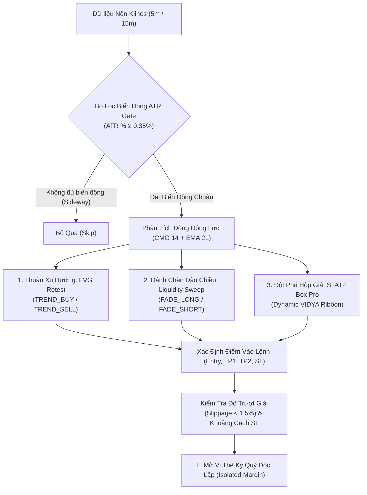
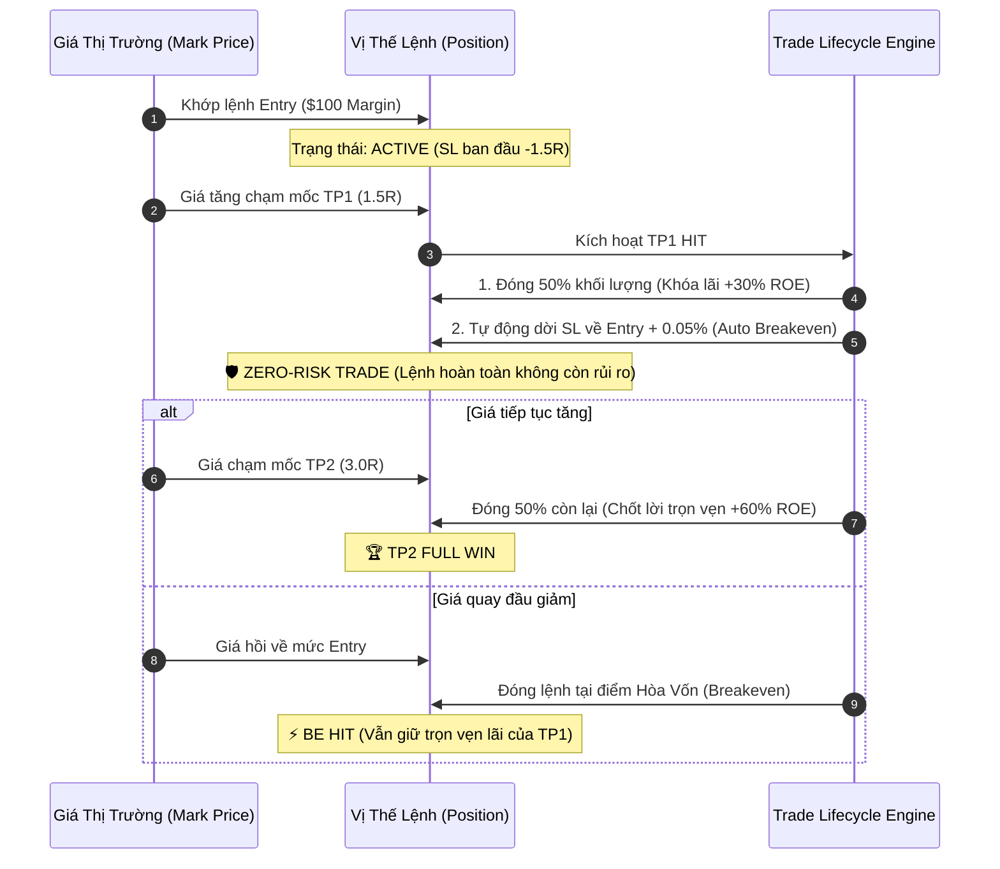
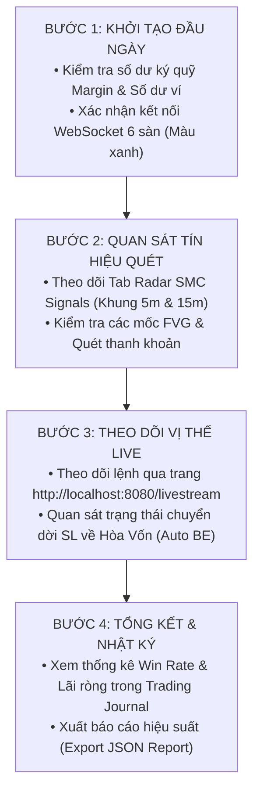

# 📘 SỔ TAY HƯỚNG DẪN CHI TIẾT CHIẾN LƯỢC GIAO DỊCH, QUẢN LÝ VỐN & HIỂN THỊ CHỈ BÁO BIỂU ĐỒ (TRADING MANUAL)

> **Hệ Thống STAT2 FUTURES PRO — Automated Multi-Exchange Quantitative Trading Platform**  
> *Tài liệu chuẩn hóa kiến trúc phân tích kỹ thuật Smart Money Concepts (SMC), mô hình phân bổ vốn trực tiếp theo Equity và hướng dẫn vận hành biểu đồ thời gian thực.*

---

## 📑 MỤC LỤC

1. [PHẦN I: TỔNG QUAN VỀ HỆ THỐNG CHIẾN LƯỢC GIAO DỊCH (TRADING STRATEGIES)](#-phần-i-tổng-quan-về-hệ-thống-chiến-lược-giao-dịch)
   - 1.1. Cấu Trúc Đa Khung Thời Gian & Bộ Lọc Biến Động ATR Gate
   - 1.2. Chiến Lược 1: SMC Fair Value Gap Retest (TREND_BUY / TREND_SELL)
   - 1.3. Chiến Lược 2: SMC Liquidity Sweep & Shark Trap (FADE_LONG / FADE_SHORT)
   - 1.4. Chiến Lược 3: STAT2 Box Pro Strategy (VIDYA Dynamic Volatility Cloud)
   - 1.5. Ma Trận Đánh Giá Tín Hiệu & Điều Kiện Kích Hoạt Lệnh
2. [PHẦN II: PHƯƠNG ÁN QUẢN LÝ VỐN & KIỂM SOÁT RỦI RO (RISK & MONEY MANAGEMENT)](#-phần-ii-phương-án-quản-lý-vốn--kiểm-soát-rủi-ro)
   - 2.1. Cơ Chế Phân Bổ Vốn Ký Quỹ Trực Tiếp Theo % Equity (Direct Equity Sizing)
   - 2.2. Bảng Tính Quy Mô Vị Thế Mẫu (Position Sizing Matrix)
   - 2.3. Quy Tắc Chốt Lời 2 Giai Đoạn (2-Stage TP) & Tự Động Kéo Hòa Vốn (Auto Breakeven)
   - 2.4. Quản Lý Rủi Ro Toàn Danh Mục & Giới Hạn Sụt Giảm Tối Đa (Max Drawdown Limit)
3. [PHẦN III: HƯỚNG DẪN HIỂN THỊ & TÙY BIẾN CHỈ BÁO TRÊN BIỂU ĐỒ (CHART INDICATORS GUIDE)](#-phần-iii-hướng-dẫn-hiển-thị--tùy-biến-chỉ-báo-trên-biểu-đồ)
   - 3.1. Kiến Trúc Biểu Đồ Kép (Lightweight Charts + High-DPI Canvas Layers)
   - 3.2. Danh Mục Các Chỉ Báo (Indicator Registry) & Cách Bật/Tắt
   - 3.3. Hướng Dẫn Tùy Chỉnh Tham Số (Inputs) & Giao Diện (Style)
   - 3.4. Thẻ Thông Tin Lệnh HUD (Trade Cards) & Các Đường Gióng (Guide Rays)
   - 3.5. Bộ Công Cụ Vẽ Kỹ Thuật (Drawing Tools)
4. [PHẦN IV: CHECKLIST QUY TRÌNH VẬN HÀNH THỰC CHIẾN HÀNG NGÀY](#-phần-iv-checklist-quy-trình-vận-hành-thực-chiến-hàng-ngày)

---

# 🎯 PHẦN I: TỔNG QUAN VỀ HỆ THỐNG CHIẾN LƯỢC GIAO DỊCH

Hệ thống vận hành động cơ **SMC Universal Engine** kết hợp cùng **STAT2 Box Dual Quantitative Engine**, tự động quét 24/7 trên hơn 3,900 cặp hợp đồng tương lai vĩnh cửu (Perpetual Futures) thuộc 6 sàn giao dịch hàng đầu (**Binance, Bybit, OKX, Bitget, Gate.io, BingX**).



---

### 1.1. Cấu Trúc Đa Khung Thời Gian & Bộ Lọc Biến Động ATR Gate

* **Khung Thời Gian Quét Mặc Định:** **5m** (Scalping / Day-Trading tốc độ cao) và **15m** (Swing-Trading theo xu hướng chủ đạo).
* **Bộ lọc ATR Gate (Average True Range Volatility Filter):**
  $$\text{ATR \%} = \frac{\text{ATR}(14)}{\text{Close Price}} \times 100$$
  * Nếu $\text{ATR \%} < 0.35\%$: Thị trường đang trong giai đoạn tắt thanh khoản (Chop/Sideway hẹp) $\rightarrow$ Hệ thống tự động **loại bỏ**, không mở lệnh để tránh bị kẹt vốn hoặc trả phí funding fee vô ích.
  * Nếu $\text{ATR \%} \ge 0.35\%$: Thị trường có xung lực sóng rõ ràng $\rightarrow$ Đủ điều kiện kích hoạt chiến lược.

---

### 1.2. Chiến Lược 1: SMC Fair Value Gap Retest (`TREND_BUY` / `TREND_SELL`)

Chiến lược bám theo dòng tiền tổ chức (Smart Money) khi thị trường để lại các vùng mất cân bằng thanh khoản giữa bên mua và bên bán (Imbalance / FVG).

```
   Nến 1         Nến 2 (Đột phá)       Nến 3
    ┌─┐               ▲                 ┌─┐
    │ │              │ │                │ │
    └─┘              │ │                └─┘ ◄── FVG Top
                     │ │                 ▲
                     │ │                 │  [ VÙNG FVG RETEST ] ──► (Điểm vào lệnh Buy)
    ┌─┐              │ │                 ▼
    │ │ ◄── FVG Bottom                  ┌─┐
    └─┘              ▼ │                │ │
```

#### A. Điều Kiện Kích Hoạt Lệnh Mua (`TREND_BUY`):
1. **Xu Hướng:** Giá đóng cửa nằm trên đường trung bình xu hướng **EMA 21** (`Close > EMA21`).
2. **Động Lượng:** Chỉ số **CMO (Chande Momentum Oscillator)** $> +10$ (Phe mua áp đảo).
3. **Cấu Trúc:** Xuất hiện vùng **Bullish FVG** (Khoảng trống giá giữa Đỉnh nến 1 và Đáy nến 3).
4. **Vùng Phản Ứng:** Giá hồi quy (Pullback) chạm vào vùng FVG và có tín hiệu rút chân.
5. **Mốc Lệnh:**
   * **Entry:** Giá đóng cửa tại thời điểm chạm FVG.
   * **Stop Loss (SL):** Dưới đáy vùng FVG $- (0.5 \times \text{ATR})$.
   * **Take Profit 1 (TP1):** $\text{Entry} + 1.5 \times (\text{Entry} - \text{SL})$ (Tỷ lệ $1.5R$).
   * **Take Profit 2 (TP2):** $\text{Entry} + 3.0 \times (\text{Entry} - \text{SL})$ (Tỷ lệ $3.0R$).

#### B. Điều Kiện Kích Hoạt Lệnh Bán (`TREND_SELL`):
1. **Xu Hướng:** Giá đóng cửa nằm dưới đường trung bình **EMA 21** (`Close < EMA21`).
2. **Động Lượng:** Chỉ số **CMO** $< -10$ (Phe bán áp đảo).
3. **Cấu Trúc:** Xuất hiện vùng **Bearish FVG** (Khoảng trống giữa Đáy nến 1 và Đỉnh nến 3).
4. **Vùng Phản Ứng:** Giá bật hồi lên chạm FVG và bị từ chối giá (Rejection).
5. **Mốc Lệnh:**
   * **Entry:** Giá đóng cửa tại thời điểm phản ứng FVG.
   * **Stop Loss (SL):** Trên đỉnh vùng FVG $+ (0.5 \times \text{ATR})$.
   * **TP1:** $\text{Entry} - 1.5 \times (\text{SL} - \text{Entry})$ ($1.5R$).
   * **TP2:** $\text{Entry} - 3.0 \times (\text{SL} - \text{Entry})$ ($3.0R$).

---

### 1.3. Chiến Lược 2: SMC Liquidity Sweep & Shark Trap (`FADE_LONG` / `FADE_SHORT`)

Chiến lược đánh chặn đảo chiều cực nhạy, khai thác bẫy thanh khoản của Market Maker khi họ quét sạch các cụm Stop Loss của đám đông tại các vùng Đỉnh/Đáy cũ.

```
       [ ĐỈNH CŨ / BSL ] ───────────────────────────┐
                                                     ▼ (Quét râu qua đỉnh)
                                                   ┌───┐
                                                   │ ┼ │ ◄── Râu nến quét thanh khoản (BSL Sweep)
                                                   ├───┤
                     ▲                             │   │
                    ┌┴┐                            │   │ ──► [ VÀO LỆNH FADE SHORT ]
                    │ │                            └───┘
                    └─┘
```

#### A. Lệnh Đánh Chặn Bắt Đáy (`FADE_LONG`):
* **Nhận Diện:** Giá đâm thủng đáy cũ (Sell-Side Liquidity - SSL) để kích hoạt lệnh bán tháo / cắt lỗ của đám đông, sau đó rút chân nến đóng cửa ngược trở lại bên trên đáy cũ.
* **Động Lượng:** $\text{CMO} \le -20$ (Vùng quá bán cực độ) hoặc giá nến hiện tại đóng cao hơn đáy nến trước.
* **Mục Tiêu:**
  * **Entry:** Mua ngay khi nến rút chân xác nhận quét thanh khoản.
  * **SL:** Đặt dưới đáy râu nến quét $- (0.5 \times \text{ATR})$.
  * **TP1 / TP2:** Tỷ lệ $1.5R$ và $3.0R$.

#### B. Lệnh Đánh Chặn Bắt Đỉnh (`FADE_SHORT`):
* **Nhận Diện:** Giá tạo râu đâm thủng đỉnh cũ (Buy-Side Liquidity - BSL) dụ đám đông mua đuổi (FOMO), sau đó bị xả hàng mạnh đóng nến quay đầu xuống dưới đỉnh cũ.
* **Động Lượng:** $\text{CMO} \ge +20$ (Vùng quá mua cực độ).
* **Mục Tiêu:**
  * **Entry:** Bán ngay khi nến từ chối đỉnh xác nhận.
  * **SL:** Đặt trên đỉnh râu nến quét $+ (0.5 \times \text{ATR})$.
  * **TP1 / TP2:** Tỷ lệ $1.5R$ và $3.0R$.

---

### 1.4. Chiến Lược 3: STAT2 Box Pro Strategy (VIDYA Dynamic Volatility Cloud)

Tích hợp thuật toán **VIDYA (Variable Index Dynamic Average)** điều chỉnh độ mượt tự động theo biến động thị trường CMO 14, kết hợp dải mây biến động **ATR Trailing Band**:
* **BULLISH REGIME:** Khi dải mây VIDYA chuyển xanh và dải ATR dưới đóng vai trò hỗ trợ động.
* **BEARISH REGIME:** Khi dải mây VIDYA chuyển đỏ và dải ATR trên đóng vai trò kháng cự động.
* Tự động xuất hiện thẻ **HUD Trade Card** trực quan ngay trên đỉnh/đáy nến phát tín hiệu.

---

### 1.5. Ma Trận Đánh Giá Tín Hiệu & Điều Kiện Kích Hoạt Lệnh

| Tiêu chí kiểm tra | Quy tắc an toàn (Risk Safety Rules) | Trạng thái xử lý |
| :--- | :--- | :--- |
| **Trượt giá (Slippage)** | Giá thị trường lệch $> 1.5\%$ so với giá tín hiệu | ❌ **HỦY BỎ (Rejected)** |
| **Giá chạm SL trước** | Giá nến live đã vượt qua mốc Stop Loss dự kiến | ❌ **HỦY BỎ (Past SL)** |
| **Giá chạm TP1 trước** | Giá nến live đã chạm qua mốc Take Profit 1 | ❌ **HỦY BỎ (Hit TP1)** |
| **Vị thế trùng lặp** | Cặp coin đã có vị thế `ACTIVE` đang chạy trên sàn đó | ⚠️ **BỎ QUA (Skip Duplicate)** |
| **Số dư ký quỹ** | Số dư khả dụng $\text{Available Balance} < \text{Initial Margin}$ | ⚠️ **CẢNH BÁO (Insufficient Margin)** |

---

# 💰 PHẦN II: PHƯƠNG ÁN QUẢN LÝ VỐN & KIỂM SOÁT RỦI RO

Nguyên tắc tối thượng của hệ thống: **"Bảo vệ vốn là ưu tiên số 1, lợi nhuận là kết quả của sự kỷ luật"**. Hệ thống sử dụng mô hình phân bổ vốn trực tiếp theo tỷ lệ phần trăm tài khoản (`Direct Equity Percentage Allocation`).

---

### 2.1. Cơ Chế Phân Bổ Vốn Ký Quỹ Trực Tiếp Theo % Equity (`Direct Equity Sizing`)

* Mỗi lệnh vào sẽ trích **chính xác $X\%$ tổng số dư ví (Equity)** làm **Ký Quỹ Ban Đầu (Initial Margin)**.
* Không phụ thuộc vào khoảng cách Stop Loss xa hay gần, giúp nhà đầu tư luôn kiểm soát chính xác mức vốn thực tế xuất ra từ ví trên từng lệnh:

$$\mathbf{\text{Initial Margin (Vốn Ký Quỹ Trích Từ Ví)}} = \mathbf{\text{Wallet Equity} \times \frac{\text{Risk \%}}{100}}$$

$$\mathbf{\text{Notional Position Size (Tổng Giá Trị Vị Thế)}} = \mathbf{\text{Initial Margin} \times \text{Leverage}}$$

$$\mathbf{\text{Quantity (Số Lượng Hợp Đồng Coin)}} = \mathbf{\frac{\text{Notional Position Size}}{\text{Entry Price}}}$$

> [!NOTE]
> **Ví dụ điển hình:**
> Tài khoản có tổng vốn Equity là **$10,000 USDT**, chọn mức rủi ro **1.0% / lệnh** và đòn bẩy **20x**:
> * **Vốn ký quỹ thực tế (Initial Margin):** $$10,000 \times 1\% = \mathbf{\$100.00\text{ USDT}}$.
> * **Tổng giá trị vị thế (Notional Size):** $$100 \times 20\text{x} = \mathbf{\$2,000.00\text{ USDT}}$.
> * Nếu vào lệnh Bitcoin tại giá **$96,500**: Khối lượng mua = $$2,000 / \$96,500 = \mathbf{0.020725\text{ BTC}}$.

---

### 2.2. Bảng Tính Quy Mô Vị Thế Mẫu (Position Sizing Matrix)

Bảng tra cứu nhanh mức Ký Quỹ và Giá Trị Lệnh tương ứng với các quy mô vốn tài khoản:

| Vốn Tài Khoản (Equity) | Tỷ Lệ Risk % | Vốn Ký Quỹ (Initial Margin) | Đòn Bẩy (Leverage) | Tổng Size Lệnh (Notional) | Lỗ tối đa khi dính SL (-1.5%) | Lãi khi chạm TP1 (+1.5%) | Lãi khi chạm TP2 (+3.0%) |
| :--- | :---: | :---: | :---: | :---: | :---: | :---: | :---: |
| **$1,000 USDT** | `1.0%` | **$10.00** | 20x | **$200.00** | $-\$3.00$ ($-30\%$ ROE) | $+\$3.00$ ($+30\%$ ROE) | $+\$6.00$ ($+60\%$ ROE) |
| **$5,000 USDT** | `1.0%` | **$50.00** | 20x | **$1,000.00** | $-\$15.00$ ($-30\%$ ROE) | $+\$15.00$ ($+30\%$ ROE) | $+\$30.00$ ($+60\%$ ROE) |
| **$10,000 USDT** | `1.0%` | **$100.00** | 20x | **$2,000.00** | $-\$30.00$ ($-30\%$ ROE) | $+\$30.00$ ($+30\%$ ROE) | $+\$60.00$ ($+60\%$ ROE) |
| **$10,000 USDT** | `0.5%` | **$50.00** | 20x | **$1,000.00** | $-\$15.00$ ($-30\%$ ROE) | $+\$15.00$ ($+30\%$ ROE) | $+\$30.00$ ($+60\%$ ROE) |
| **$10,000 USDT** | `2.0%` | **$200.00** | 20x | **$4,000.00** | $-\$60.00$ ($-30\%$ ROE) | $+\$60.00$ ($+30\%$ ROE) | $+\$120.00$ ($+60\%$ ROE) |
| **$50,000 USDT** | `1.0%` | **$500.00** | 20x | **$10,000.00** | $-\$150.00$ ($-30\%$ ROE) | $+\$150.00$ ($+30\%$ ROE) | $+\$300.00$ ($+60\%$ ROE) |

---

### 2.3. Quy Tắc Chốt Lời 2 Giai Đoạn (2-Stage TP) & Tự Động Kéo Hòa Vốn (Auto Breakeven)

Để triệt tiêu tâm lý gồng lỗ và bảo toàn lợi nhuận tối đa, hệ thống áp dụng cơ chế quản lý lệnh thông minh tự động:



---

### 2.4. Quản Lý Rủi Ro Toàn Danh Mục & Giới Hạn Sụt Giảm Tối Đa

* **Chế Độ Ký Quỹ Độc Lập (Isolated Margin Mode):** Mọi lệnh giao dịch đều hoạt động trong khoang ký quỹ riêng biệt. Khi có biến động thiên nga đen (Black Swan), mức thua lỗ tối đa của một lệnh chỉ bằng đúng số tiền Ký Quỹ Ban Đầu của lệnh đó, tuyệt đối không ảnh hưởng đến số dư còn lại trong tài khoản.
* **Giới Hạn Lệnh Mở Đồng Thời (`max_concurrent_positions`):** Mặc định tối đa **5 vị thế mở cùng lúc**. Tổng số vốn ký quỹ cam kết ra thị trường không bao giờ vượt quá $5 \times 1\% = 5\%$ tổng tài sản.
* **Khóa Cháy Tài Khoản Trong Ngày (`daily_max_drawdown_pct`):** Nếu tổng mức thua lỗ trong 24 giờ chạm ngưỡng **4.0%**, hệ thống sẽ tự động kích hoạt **Kill-Switch**, ngưng toàn bộ việc quét và mở vị thế mới để bảo toàn vốn.

---

# 📊 PHẦN III: HƯỚNG DẪN HIỂN THỊ & TÙY BIẾN CHỈ BÁO TRÊN BIỂU ĐỒ

Hệ thống biểu đồ được xây dựng dựa trên công nghệ **TradingView Lightweight Charts v4.2** kết hợp lớp phủ đồ họa độ phân giải cao **High-DPI 2D Canvas Layer**, mang lại trải nghiệm phân tích nến mượt mà 60 FPS.

---

### 3.1. Kiến Trúc Biểu Đồ Kép

Biểu đồ bao gồm 3 thành phần chính xếp lớp đồng bộ thời gian thực:
1. **Lớp Dưới Cùng (Lightweight Charts Series):** Nến Candlestick chuẩn Binance/Bybit, khối lượng Volume Histogram, đường EMA 21/50/200, đường VWAP.
2. **Lớp Ở Giữa (High-DPI Canvas Overlay):** Các khối hộp FVG (Fair Value Gap), đường kẻ thanh khoản BSL/SSL, dải mây động lượng VIDYA, đường gióng Entry/TP1/TP2/SL và Thẻ thông tin lệnh HUD.
3. **Lớp Trên Cùng (UI Legend & Toolbars):** Thanh trạng thái chỉ báo kiểu TradingView (`👁️ Ẩn/Hiện`, `⚙️ Cài đặt`, `✕ Xóa`), thước đo và thanh công cụ vẽ.

---

### 3.2. Danh Mục Các Chỉ Báo (Indicator Registry) & Cách Bật/Tắt

Tại thanh công cụ phía trên biểu đồ, nhấn vào nút **`Indicators (fx)`** để mở bảng danh mục các chỉ báo:

```
┌────────────────────────────────────────────────────────────────────────┐
│ 📐 DANH MỤC CHỈ BÁO & CHIẾN LƯỢC (INDICATORS CATALOG)                 │
├────────────────────────────────────────────────────────────────────────┤
│  [⭐] STAT2 Pro Box Strategy (HUD Cards, Guide Rays, SMC FVG & Liq)   │ ──► [ + Thêm vào Chart ]
│  [📈] EMA Ribbon (EMA 21, EMA 50, EMA 200 Tri-Color)                  │ ──► [ + Thêm vào Chart ]
│  [🌊] VWAP (Volume Weighted Average Price + Multi-Stdev Bands)         │ ──► [ + Thêm vào Chart ]
│  [🛡️] ATRBot Dynamic Trailing Stop & Volatility Risk Bands            │ ──► [ + Thêm vào Chart ]
│  [📊] SMC Smart Money Concepts (BOS, CHoCH, Order Blocks, Liquidity)  │ ──► [ + Thêm vào Chart ]
│  [📊] VSR (Volume Spread Range & Flow Profile)                         │ ──► [ + Thêm vào Chart ]
└────────────────────────────────────────────────────────────────────────┘
```

#### Thao tác trên thanh Legend (Góc trên bên trái biểu đồ):
* **`👁️ (Con mắt):`** Bật hoặc tắt hiển thị chỉ báo tức thì mà không làm mất cấu hình.
* **`⚙️ (Bánh răng):`** Mở bảng cài đặt chuyên sâu (Inputs & Style).
* **`✕ (Dấu nhân):`** Xóa chỉ báo khỏi biểu đồ hiện tại.

---

### 3.3. Hướng Dẫn Tùy Chỉnh Tham Số (Inputs) & Giao Diện (Style)

Khi nhấn vào biểu tượng **`⚙️ Bánh răng`** của chỉ báo **STAT2 Pro Box Strategy**:

#### Tab 1: Tham Số Tính Toán (Inputs)
* **`strategyMode`:** Chọn chế độ quét (`dual`: Vừa thuận xu hướng vừa bắt đỉnh đáy, `trend_only`: Chỉ đánh theo trend, `fade_only`: Chỉ bắt râu quét thanh khoản).
* **`cmoLength`:** Độ dài chu kỳ nến CMO (Mặc định `14`).
* **`maLength`:** Chu kỳ đường trung bình EMA (Mặc định `21`).
* **`atrLength` & `atrMult`:** Chu kỳ ATR (`14`) và Hệ số nhân khoảng cách SL (`2.0`).
* **`minAtrPct`:** Ngưỡng lọc biến động tối thiểu (Mặc định `0.35%`).
* **`maxCardsVisible`:** Số lượng thẻ lệnh tối đa hiển thị cùng lúc trên màn hình (Mặc định `15 thẻ`).

#### Tab 2: Tùy Chỉnh Giao Diện & Màu Sắc (Style)
* **`showCards` (Bật/Tắt Hộp HUD):** Chọn hiển thị hoặc ẩn các thẻ lệnh nổi.
* **`cardBackground` & `cardOpacity`:** Màu nền và độ mờ của thẻ lệnh (Mặc định nền tối `#0b1120`, độ mờ `0.94`).
* **`showGuideLines` (Đường gióng tia):** Bật các tia gióng nối từ thẻ lệnh đến mức giá Entry, TP1, TP2, SL trên biểu đồ.
* **`showFVG` & `fvgOpacity`:** Bật các khối chữ nhật đánh dấu vùng mất cân bằng FVG (Độ mờ vùng nến `0.18`).
* **`showLiquidity`:** Bật các đường nét đứt đánh dấu vùng thanh khoản đỉnh (BSL - Hồng) và đáy (SSL - Tím).
* **Bảng màu:** Tùy biến mã màu HEX cho lệnh Buy (Xanh `#10b981`), Sell (Đỏ `#f43f5e`), Fade Long (Xanh Cyan `#06b6d4`), Fade Short (Vàng Cam `#f59e0b`).

> [!TIP]
> Toàn bộ cài đặt hiển thị và chỉ báo của bạn được **tự động lưu vào `localStorage` của trình duyệt**. Khi bạn chuyển đổi giữa các cặp coin hoặc tải lại trang, biểu đồ sẽ giữ nguyên 100% cấu hình ưa thích của bạn.

---

### 3.4. Thẻ Thông Tin Lệnh HUD (Trade Cards) & Các Đường Gióng (Guide Rays)

Mỗi khi hệ thống phát hiện một cơ hội vào lệnh chuẩn, một thẻ **HUD Trade Card** sẽ được vẽ ngay tại vị trí nến đó:

```
┌──────────────────────────────────────────────┐
│  ▲ BUY TREND                 [ 🟢 ACTIVE ]   │ ◄── Tiêu đề lệnh & Trạng thái Live
├──────────────────────────────────────────────┤
│  Mốc Entry :  $96,500.00                     │ ──► Đường gióng Xanh Lam tới giá Entry
│  Mục Tiêu 1:  $97,947.50 (+1.50% / +30% ROE) │ ──► Đường gióng Xanh Lá tới mốc TP1
│  Mục Tiêu 2:  $99,395.00 (+3.00% / +60% ROE) │ ──► Đường gióng Xanh Cyan tới mốc TP2
│  Cắt Lỗ SL :  $95,535.00 (-1.00% / -20% ROE) │ ──► Đường gióng Đỏ tới mốc SL
├──────────────────────────────────────────────┤
│  ⚡ R:R 2.25  •  ATR: 0.85%  •  CMO: +28.4    │ ◄── Chỉ số định lượng Forensics
└──────────────────────────────────────────────┘
```

---

### 3.5. Bộ Công Cụ Vẽ Kỹ Thuật (Drawing Tools)

Thanh công cụ vẽ nằm cố định bên mép trái biểu đồ hỗ trợ phân tích thủ công chuyên sâu:
1. **`👆 Con Trỏ Chuột (Cursor):`** Chế độ tương tác, rê chuột xem giá nến (OHLCV tooltip).
2. **`📈 Đường Xu Hướng (Trendline):`** Click 2 điểm để kẻ đường chéo hỗ trợ/kháng cự.
3. **`📐 Fibonacci Thoái Lui (Fib Retracement):`** Kéo từ Đáy lên Đỉnh để xác định các tỷ lệ vàng 0.382, 0.5, 0.618, 0.786.
4. **`🔲 Khung Chữ Nhật (Rectangle):`** Vẽ các vùng cản Cung/Cầu (Supply/Demand) hoặc vùng tích lũy giá.
5. **`📏 Đo Khoảng Giá & Tỷ Lệ (Price & Date Range):`** Kéo đo phần trăm tăng giảm giá (%) và số lượng cây nến trong một khoảng thời gian.
6. **`🗑️ Xóa Bản Vẽ (Clear Drawings):`** Xóa nhanh các hình vẽ thủ công trên biểu đồ hiện tại.

---

# 🚀 PHẦN IV: CHECKLIST QUY TRÌNH VẬN HÀNH THỰC CHIẾN HÀNG NGÀY

Để tối ưu hóa hiệu suất giao dịch tự động và quản lý rủi ro an toàn, nhà đầu tư nên tuân thủ quy trình 4 bước sau:



1. **Khởi động và cài đặt:**
   * Sử dụng **Setup Wizard** 🧙‍♂️ khi cần thiết lập lại mức vốn ban đầu, điều chỉnh tỷ lệ đòn bẩy hoặc thay đổi danh sách các sàn giao dịch kích hoạt.
2. **Màn hình giám sát Livestream & Di động:**
   * Mở trang 👉 **`http://localhost:8080/livestream`** trên màn hình phụ hoặc thiết bị di động để theo dõi danh sách vị thế đang mở dưới dạng bảng tài chính tốc độ cao, hỗ trợ sắp xếp theo PnL, ROE% và đóng lệnh khẩn cấp tức thì.
3. **Báo cáo định lượng:**
   * Mở mục **Trading Journal** cuối mỗi phiên giao dịch để đánh giá tỷ lệ thắng (Win Rate), hệ số lợi nhuận (Profit Factor) và kiểm tra lại lịch sử nhật ký từng lệnh giao dịch.

---

*Tài liệu này được biên soạn độc quyền cho hệ thống **STAT2 FUTURES PRO**. Mọi thuật toán tính toán và logic quản lý vốn đã được kiểm thử và đồng bộ 100% trong mã nguồn.*
